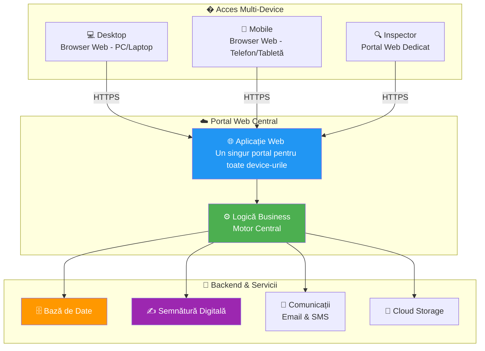
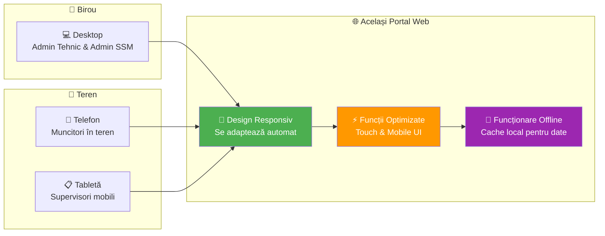
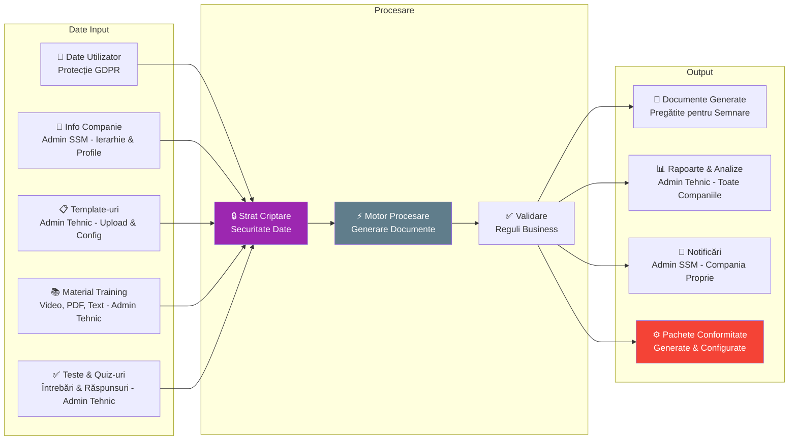

# Arhitectură Sistem - Componente Tehnice

## Arhitectură Sistem de Nivel Înalt

## Accesul Aplicatie - Portal Web

## Flux Date & Securitate

## Caracteristici Securitate & Conformitate

| Caracteristică | Beneficiu |
|----------------|-----------|
| **🔐 Semnături Digitale AES/QES** | Documente cu valoare legală |
| **🛡️ Protecție Date GDPR** | Confidențialitate & drepturi utilizator |
| **🔒 Stocare Criptată** | Securitate date în repaus |
| **📋 Jurnal Audit** | Înregistrare completă activități |
| **🌐 Comunicații Securizate** | Transmisie date protejată |