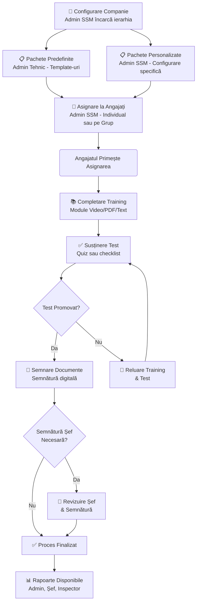
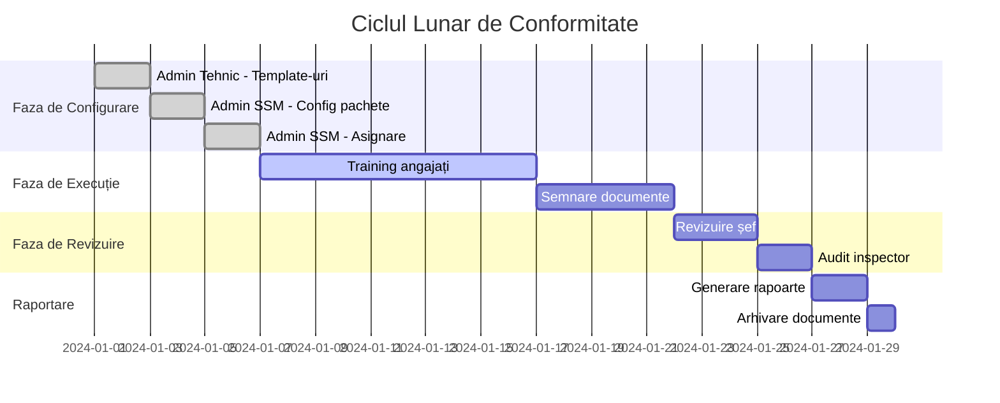

# Business Process - Cum se Desfășoară Munca

## Procesul Complet de Certificare

## Ciclul Lunar de Business

## Metrici Cheie Monitorizate

| Metrică | Scop | Responsabil |
|---------|------|------------|
| **📊 Rata de Finalizare** | Urmărește progresul training-ului | Șefi |
| **⏱️ Timp de Completare** | Identifică blocajele | Admin Tehnic (toate companiile) Admin SSM (compania proprie) |
| **✅ Rate Promovare/Respingere** | Eficiența training-ului | Admin Tehnic (toate companiile) Admin SSM (compania proprie) |
| **📄 Status Documente** | Pregătire pentru conformitate | Inspector |
| **🔔 Elemente Întârziate** | Managementul riscurilor | Toate rolurile |