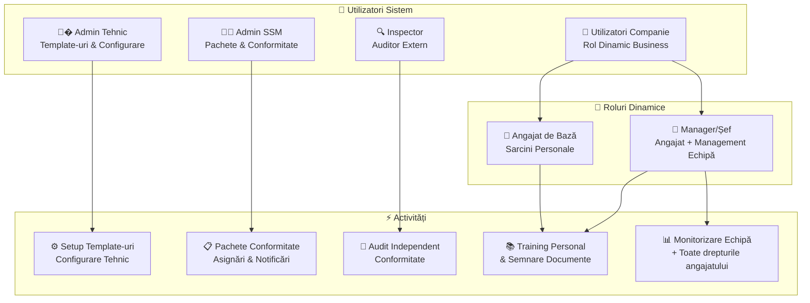
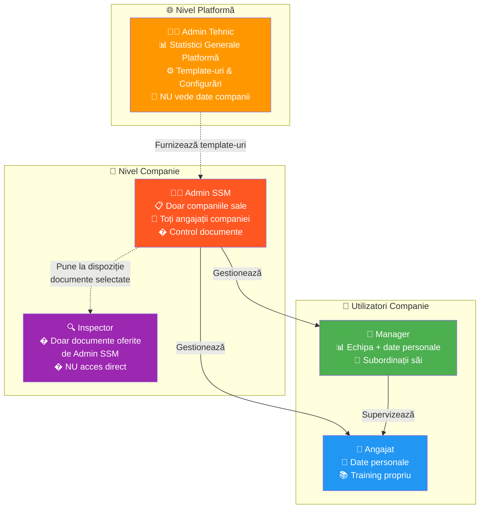
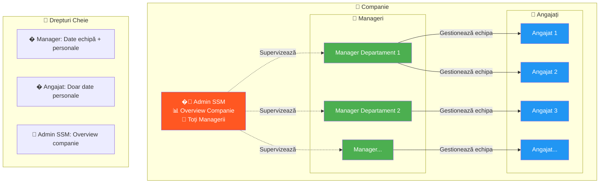

# Roluri in Aplicatie

## Cine Folosește Sistemul și Ce Fac

## Niveluri de Acces

## Beneficii Cheie pentru Fiecare Rol

| Rol | Beneficii Cheie | Limitări |
|-----|----------------|----------|
| **👨‍💻 Admin Tehnic** | Template-uri globale, configurare sistem, statistici generale platformă | ❌ Nu vede date din companii specifice |
| **👨‍🔧 Admin SSM** | Gestionare companiile sale, pachete conformitate, control documente pentru inspector | ✅ Acces complet doar la companiile sale |
| **🔍 Inspector** | Audit bazat pe documente oferite de Admin SSM | ❌ Nu are acces direct, doar la materialele puse la dispoziție |
| **👔 Manager** | **Toate drepturile angajatului** + monitorizare echipă din compania sa | ✅ Acces complet la subordinații săi |
| **👷 Angajat** | Training personal, semnare documente, progres vizibil | ❌ Doar datele proprii |

## Ierarhia și Relațiile Cheie în Sistem

