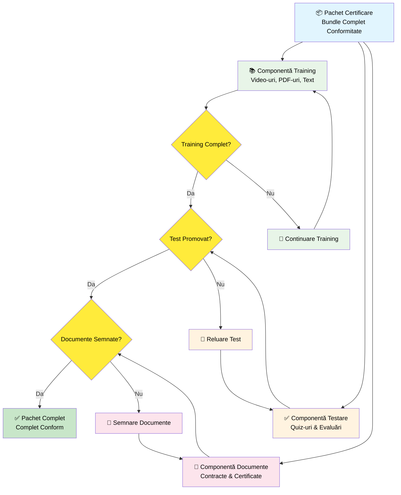
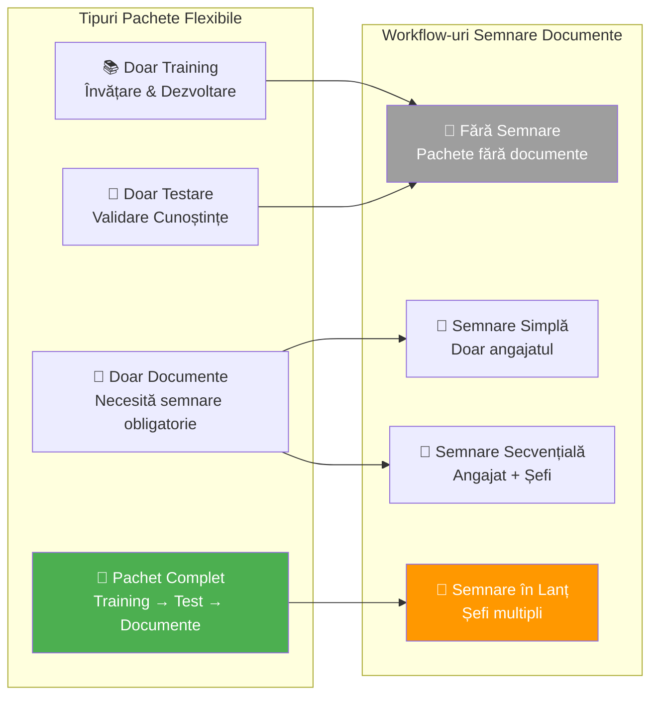
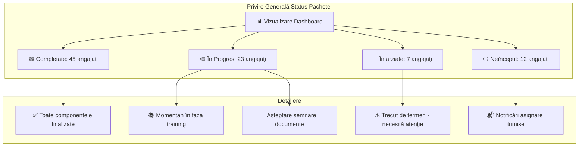

# Workflow Pachete Certificare - Inima Sistemului

## Ce Este un Pachet de Certificare?

## Opțiuni Configurare Pachete

## Strategii Asignare Pachete

| Tip Asignare | Cel Mai Bun Pentru | Exemplu Caz de Utilizare |
|-------------|-------------------|------------------------|
| **👤 Individual** | Roluri specifice/angajări noi | Pachet onboarding CEO |
| **👥 Grup** | Training la nivel departament | Securitate IT pentru echipa tech |
| **🏢 La nivel companie** | Conformitate universală | Certificare anuală securitate |
| **📋 Bazat pe rol** | Nevoi specifice poziție | Training leadership manageri |

## Dashboard Urmărire Progres

## Beneficii pentru Stakeholderi Diferiți

| Stakeholder | Beneficii Cheie | Valoare Livrată |
|------------|----------------|-----------------|
| **👨‍� Admin Tehnic** | Template-uri centralizate, rapoarte detaliate | Control tehnic & analitică |
| **👨‍🔧 Admin SSM** | Asignări facile, notificări automate, lanț semnături | Management conformitate eficient |
| **👔 Șef** | Vizibilitate progres echipă | Management proactiv activat |
| **👷 Angajat** | Cale clară pentru finalizare | Confuzie & întârzieri reduse |
| **🔍 Inspector** | Documentație pregătită audit | Verificare conformitate mai rapidă |