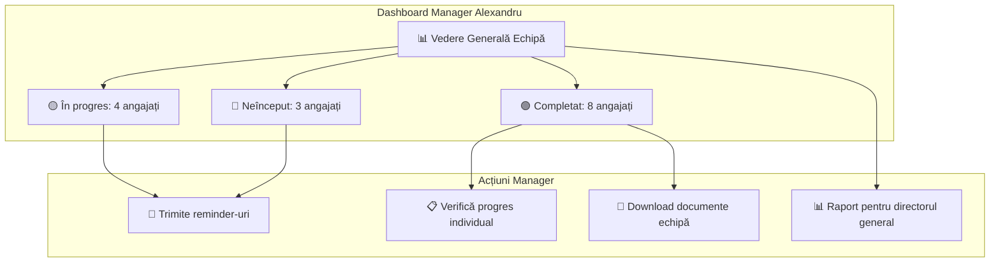
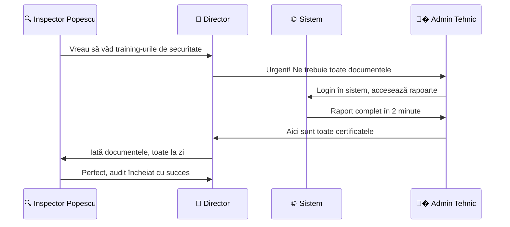
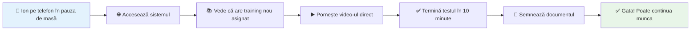
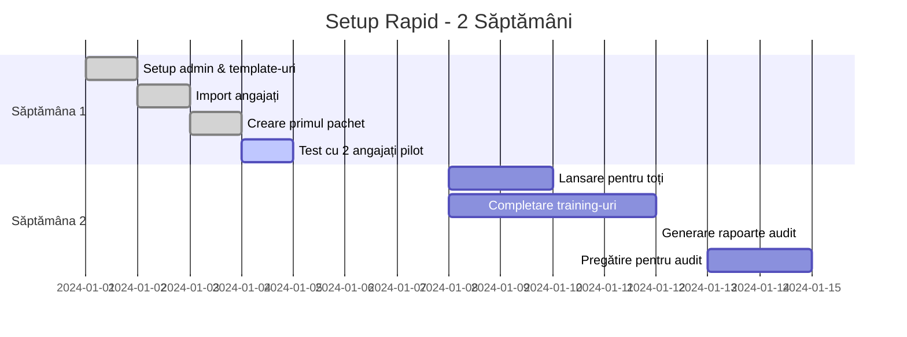

# Scenarii de Utilizare - Exemple Practice

## Scenariul 1: Angajat Nou - Onboarding Complet

### Context
Maria este angajată nouă la o firmă de construcții și trebuie să treacă prin procesul complet de onboarding cu training de securitate.

### Pașii Detaliați

| Pas | Cine | Ce Face | Timp Necesar | Rezultat |
|-----|------|---------|-------------|----------|
| **1** | 👨‍� Admin SSM | Creează contul Mariei și asignează pachetul "Onboarding Securitate" | 5 min | Maria primește email automat |
| **2** | 👷 Maria | Se loghează și vede dashboard-ul cu pachetul asignat | 2 min | Vede progresul 0% și pașii de urmat |
| **3** | 👷 Maria | Urmărește 3 video-uri de securitate (15 min fiecare) | 45 min | Progres: 33% complet |
| **4** | 👷 Maria | Citește manualul de proceduri SSM (PDF) | 30 min | Progres: 66% complet |
| **5** | 👷 Maria | Susține testul cu 20 întrebări | 15 min | Promovează cu 85% (necesita 80%) |
| **6** | 👷 Maria | Semnează digital contractul de securitate | 3 min | Document trimis la șef pentru aprobare |
| **7** | 👔 Șef | Primește notificare, revizuiește și aprobă | 5 min | Document finalizat și arhivat |
| **8** | 🔄 Sistem | Generează certificatul și actualizează statusul | Automat | Maria este acum conform |

---

## Scenariul 2: Manager - Monitorizare Echipă

### Context
Alexandru este șef de echipă cu 15 subordinați și trebuie să se asigure că toată lumea și-a făcut training-ul anual de securitate până la finalul lunii.

### Workflow Manager

| Moment | Alexandru Face | Sistem Răspunde | Beneficiu |
|--------|----------------|-----------------|-----------|
| **Luni dimineața** | Se loghează și verifică dashboard-ul | Arată status real-time al celor 15 subordinați | Vede imediat cine e în urmă |
| **Luni seara** | Trimite reminder celor 7 care nu au terminat | Email automat cu link direct la training | Nu trebuie să caute email-uri manual |
| **Miercuri** | Verifică din nou progresul | 4 au terminat între timp, rămân 3 în urmă | Vede progresul în timp real |
| **Joi** | Sună la cei 3 rămasași și îi întreabă de probleme | Poate vedea exact unde s-au blocat | Poate oferi ajutor specific |
| **Vineri** | Toată echipa a terminat, generează raport | Un click - raport Excel cu toate detaliile | Raport complet pentru director în 30 secunde |

## Scenariul 3: Inspector - Audit Surpriză

### Context
Inspectorul de muncă Popescu vine neanunțat la firma de construcții și cere dovezi că toți lucrătorii au training de securitate valid.

---

## Scenariul 4: Angajat Veteran - Training Periodic

### Context
Ion lucrează în firmă de 5 ani și trebuie să-și reînnoiască training-ul de securitate. E obișnuit cu sistemul.

### Experiența Veteranului

| Aspect | Experiența lui Ion | Beneficiu |
|--------|-------------------|-----------|
| **Timp total** | 25 minute în pauza de masă | Nu ia din programul de lucru |
| **Locație** | Din telefon, lângă șantier | Nu trebuie să meargă la birou |
| **Complexitate** | Cunoaște deja sistemul | Zero timp de învățare |
| **Întreruperi** | Poate salva progresul oricând | Flexibilitate maximă |

---

## Scenariul 5: Companie Mică - Setup Rapid

### Context
Firma "Instalații Rapide SRL" cu 12 angajați vrea să implementeze sistemul rapid pentru un audit în 2 săptămâni.

### Timeline Implementare

### Rezultat Final

| Obiectiv | Realizat | Status |
|----------|----------|--------|
| **12 angajați certificați** | ✅ 12/12 completat | 100% success |
| **Documente pentru audit** | ✅ Toate generate | Pregătit complet |
| **Timp implementare** | ✅ 10 zile lucru | Sub target (14 zile) |
| **Probleme întâmpinate** | ✅ Zero probleme majore | Implementare netedă |

---

## Beneficii Comune Observate

### Pentru Angajați
- 📱 **Acces oriunde**: pot învăța în pauze, acasă, în transport
- ⏱️ **La propriul ritm**: nu sunt forțați să termine totul odată
- 📊 **Progres vizibil**: știu exact ce mai au de făcut

### Pentru Manageri  
- 👀 **Vizibilitate completă**: văd instant cine e în urmă
- 🔔 **Automatizare**: reminder-uri trimise automat
- 📊 **Rapoarte instant**: nu mai așteaptă să caute prin hârtii

### Pentru Admin Tehnic (UNU SINGUR)
- ⚙️ **Setup global**: configurare template-uri pentru toate companiile
- 📊 **Rapoarte cross-company**: analitică completă toate companiile
- 🔄 **Scalabilitate**: infrastructură tehnică centralizată

### Pentru Admin SSM (UNU PER COMPANIE)
- 📋 **Conformitate garantată**: toate procesele SSM compania proprie
- 🎯 **Asignări specifice**: pachete configurate pentru compania sa  
- 🔔 **Notificări targeted**: focus pe angajații companiei sale