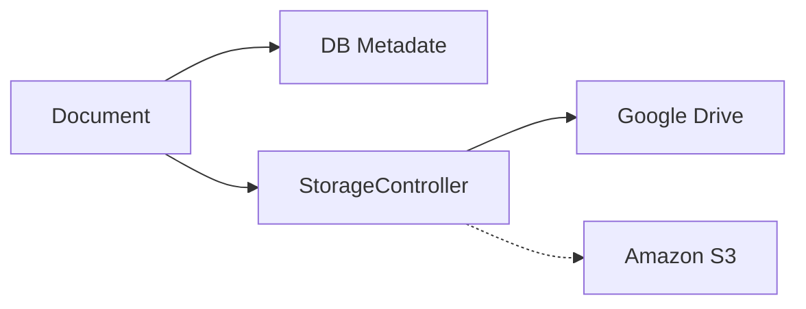

# Diagrama stocare documente (prezentare sistem)

Scop
- MVP: clientul își conectează Google Drive; backend-ul servește fișierele prin proxy.
- Extensibil: ulterior se poate folosi și S3 ca opțiune premium, fără a schimba fluxurile de business.

## Vedere din perspectiva Documentului

Note
- Metadatele documentului se salvează în DB; conținutul merge prin StorageController către providerul de stocare.
- Nu se expun linkuri publice; livrarea fișierelor se face via StorageController.

## Ce salvăm în DB (metadate minimale)
- Document: id, tenant, titlu, tip (ex: CONTRACT/RAPORT), status, versiune curentă, timestamps.
- Versiune: documentId, versiune, filename, mime, mărime, checksum, provider, externalId (fileId/key), creator, timestamps.
- Config stocare per client: provider (gdrive/s3), referință secret (ex: în secret manager), rootFolder/bucket, region.

## Ce trece prin StorageController (contract simplificat)
- put: primește conținutul fișierului (stream/bytes), îl urcă la provider (ex: Google Drive) și returnează identificatorul extern (externalId) + dimensiune + mime. În urma acestui pas, aplicația scrie metadatele în DB.
- get: citește conținutul pe baza externalId-ului și îl livrează ca stream.
- delete: inițiază ștergerea din provider (opțional imediat) și marchează în DB versiunea/documentul ca șters (soft delete recomandat).
- listVersions: nu trece prin provider; doar citește din DB.

Mapping pe operații
- Creare/actualizare versiune document:
  - StorageController: upload conținut → primește externalId și size/mime.
  - Database: salvează/actualizează versiunea cu externalId, provider, checksum, mime, size, versiune curentă.
- Download document:
  - StorageController: citește conținutul de la provider pe baza externalId.
  - Database: folosit doar pentru a afla ce versiune și care externalId; nu se stochează conținutul.
- Ștergere document/versiune:
  - StorageController: ștergere în provider (imediat sau în job de background).
  - Database: marchează statusul (ex: SOFT_DELETED) și păstrează istoricul.

## Flux de bază (text)
1) Upload: Client → API → StorageController → Provider (salvare) → DB (metadate).
2) Download: Client → API → StorageController → Provider (stream) → Client.
3) Delete: API → StorageController → Provider (opțional) + DB (status/versiune).

