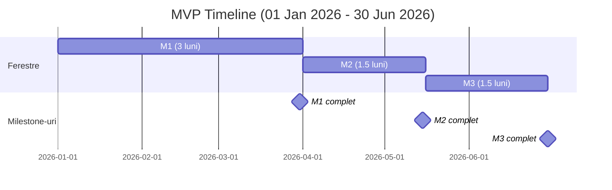

# Estimări MVP (Minimum Viable Product) (single SSM-ist – Crina)

Scop: MVP orientat pe un singur SSM-ist (Crina), fără plăți/subscription, fără Landing Page, doar self-sign pentru documente, generare documente pe bază de template cu parametri și tabele (fără SDK avansat). Include companii cu organigramă, invitații utilizatori, RBAC minim și construcția pachetelor de conformitate (traininguri, teste, documente de semnat).

Referințe documentație:
- Arhitectură & securitate: [01-arhitectura-sistem.md](01-arhitectura-sistem.md)
- Procese business: [02-flux-procese-business.md](02-flux-procese-business.md)
- Roluri & permisiuni: [03-privire-roluri-utilizatori.md](03-privire-roluri-utilizatori.md)
- Workflow pachete: [04-workflow-pachete-certificare.md](04-workflow-pachete-certificare.md)
- Stocare documente: [06-diagrama-stocare-documente.md](06-diagrama-stocare-documente.md)

Asumări MVP:
- Single-tenant (un SSM-ist – Crina). Tenancy simplificat, dar RBAC necesar: Admin SSM, Manager, Angajat.
- Fără module de plăți/subscription, fără Landing/Blog.
- Semnare documente: doar Self Sign (plasare zonă semnătură + generare PDF semnat local/pe server).
- Template DOCX cu parametri și tabele (merge fields), fără SDK avansat.
- Stocare primară: AWS S3 prin StorageController (put/get/delete cu URL-uri presemnate), metadate în DB; arhivare în Google Drive (conectare cont per SSM-ist și politici de arhivare) inclusă în MVP.
- Minim de tracking pentru teste: scor, pass/fail, timestamps (nu stocăm răspunsurile brute).
- Inspector view read-only minimal inclus: acces prin link tokenizat cu expirare la setul de documente pregătite de SSM-ist.

Out-of-scope în MVP:
- Subscription/Payments, QES/semnături avansate, Inspector portal avansat, Landing/Blog, rapoarte avansate și orice integrare enterprise.

---

## Pachet Core (servicii comune, backend, modele, integrare storage)

 - Autentificare + RBAC (Supabase Auth, roluri: Admin SSM, Manager, Angajat), guards API, politici minime de permisiuni: 50h
 - Model de date și migrații (utilizatori, companii, organizații, invitații, traininguri, teste, rezultate, template-uri, documente, pachete): 30h
 - Import organigramă din Excel (parser + mapare entități + validări): 55h
 - Serviciu invitații (token-uri, expirare, email templates, validare): 40h
 - Serviciu training (CRUD module, paginare/ordonare, referințe media): 40h
 - Serviciu testare (CRUD chestionare, scoring, rezultate minime; fără stocare răspunsuri brute): 50h
 - Serviciu template & generare documente (DOCX merge: parametri + tabele) + conversie PDF: 70h
 - StorageController + integrare AWS S3 (upload/download/delete, presigned URLs; metadate în DB; fără linkuri publice): 55h
 - Integrare arhivare Google Drive (per SSM-ist): conectare cont (OAuth), configurare politici de arhivare, push copie PDF/Doc la arhivare: 35h (BE)
 - Self-sign service (coordonate semnătură, tamponare în PDF, audit minim): 45h
 - Notificări email de bază (invitații, asignare pachet, remindere simple): 30h
 - Inspector access service (generare link/token cu expirare, scope pe setul de documente, permisiuni read-only, audit evenimente vizualizare): 25h
 - Audit logs minimal (creare/actualizare entități critice, semnare, generare doc): 25h

Subtotal Pachet Core (BE): 550h

---

## Pachet Client (Web SPA – UI pentru SSM, Manager, Angajat)

 - Auth pages + protected routes + meniu în funcție de rol: 30h
 - Dashboard SSM minimalist (stare pachete, acțiuni rapide): 20h
 - Companii: listă + detalii: 20h
 - Organigramă: editor + import din Excel + validări UI: 80h
 - Angajați: listare, editare date, invitații (flow UI): 40h
 - Builder pachete (training + test + documente) – creare/assign: 80h
 - Training viewer (navigare pagini, progress, materiale): 40h
 - Test taking UI (sequențial/listă, submit, afișare rezultat): 40h
 - Document signing UI (preview PDF + plasare semnătură + submit): 40h
 - Document library (listare, filtre, download/ștergere soft): 40h
 - Setări arhivare Google Drive: conectare cont, on/off arhivare: 20h
 - Inspector view UI (read-only): afișare set documente accesibile prin link, acțiuni limitate (vizualizare/descărcare dacă e permis), mesaje expirare/link invalid: 40h
 - Panou notificări/to-do simplu: 20h
 - Vederi rapoarte de bază (finalizări, pass/fail, status documente): 30h

Subtotal Pachet Client (FE): 540h

---

## DevOps, QA, Securitate

 - CI/CD simplu, management environment/secret, build & deploy: 40h
 - Teste E2E pentru fluxuri critice (invitație→register, pachet→training→test→semnare→document): 60h
 - Securitate de bază (rate limits, validări input, politici CORS, logare securizată): 20h

Subtotal DevOps/QA: 120h

---

## Total estimat MVP
 - Pachet Core: 550h
 - Pachet Client: 540h
 - DevOps/QA: 120h
 - Total: 1,210h

Observații:
- MVP exclude plățile, QES și multi-tenant; complexitatea scade față de platforma finală.
- Inspector view read-only este inclus în MVP; varianta avansată de portal inspector rămâne out-of-scope.

Criterii de acceptare MVP (rezumat):
- RBAC minim funcțional (Admin SSM, Manager, Angajat); acces segregat corect.
- CRUD companii + organigramă (import Excel) + invitații angajați funcționale.
- Builder pachete: se pot crea pachete ce conțin training + test + document; se pot asigna la angajați.
- Training viewer + Test runner cu evaluare și salvare rezultat minimal.
- Generare document din template (parametri+tabele) + Self Sign + PDF rezultat stocat în S3, vizibil în bibliotecă; copie sincronizată în Google Drive conform politicilor de arhivare.
- Notificări de bază (invitații, asignări, remindere simple) și rapoarte de bază (pass/fail, finalizări, status documente).
- Audit minimal pentru acțiuni critice.
 - SSM-istul poate pregăti un set de documente pentru inspecție și genera un link securizat (token + expirare); inspectorul poate accesa în mod read-only și, dacă politicile permit, descărca documentele; evenimentele de acces sunt jurnalizate minimal.

---

## Timeline 6 luni și Milestone-uri (bazat pe estimarea MVP)

Asumare: livrăm incremental astfel încât după ~3 luni să existe un produs pilot utilizabil în producție limitată (onboarding 1–2 companii), apoi extindem capabilități și stabilizăm până la 6 luni.

### Milestone 1 — Luna 3: Pilot utilizabil (Go-Live limitat)
- Core minim operabil: Auth/RBAC, model date, invitații + emailuri, training + test (scoring), generare DOCX→PDF, Self-sign, stocare S3, audit minimal.
- FE minim pe flux: Auth, dashboard, companii/angajați, import organigramă din Excel, builder pachete, training/test runner, document signing, library basic.
- DevOps/Securitate de bază: CI/CD simplu, CORS/rate-limit/validări input.
Rezultat: produs pilot utilizabil pentru 1–2 companii (creare pachete, invitații, training/test, semnare documente cu stocare sigură).

### Milestone 2 — Luna 4.5: Conformitate operațională extinsă
- Arhivare Google Drive + setări UI; Inspector view read-only cu link tokenizat și audit acces.
- Îmbunătățiri UI/UX: editor organigramă, library cu filtre/soft delete, panou notificări; rapoarte de bază.
- Securitate/Calitate: hardening, începere teste E2E și remedieri din pilot.
Rezultat: flux MVP acoperit end-to-end, pregătit pentru mai multe companii și utilizatori.

### Milestone 3 — Luna 6: MVP complet și stabilizare
- Finalizare criterii de acceptare MVP; E2E extinse + regresie.
- Observabilitate și backup/restore; revizuire RBAC și audit trail.
- Optimizări performanță/UX; documentație și onboarding.
Rezultat: MVP stabil, testat și pregătit pentru producție.

---

## Diagrama Gantt (Mermaid) — Timeline 6 luni pornind de la 1 ianuarie 2026

