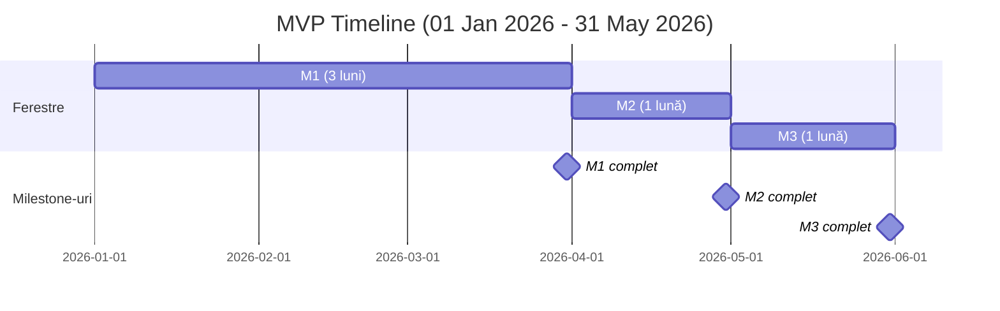

# Estimări MVP (Minimum Viable Product) (single SSM-ist – Crina)

Scop: MVP orientat pe un singur SSM-ist (Crina), fără plăți/subscription, fără Landing Page, doar self-sign pentru documente, generare documente pe bază de template cu parametri și tabele (fără SDK avansat). Include companii cu organigramă, invitații utilizatori, RBAC minim și construcția pachetelor de conformitate (traininguri, teste, documente de semnat).

Referințe documentație:
- Arhitectură & securitate: [01-arhitectura-sistem.md](01-arhitectura-sistem.md)
- Procese business: [02-flux-procese-business.md](02-flux-procese-business.md)
- Roluri & permisiuni: [03-privire-roluri-utilizatori.md](03-privire-roluri-utilizatori.md)
- Workflow pachete: [04-workflow-pachete-certificare.md](04-workflow-pachete-certificare.md)
- Stocare documente: [06-diagrama-stocare-documente.md](06-diagrama-stocare-documente.md)

Asumări MVP:
- Single-tenant (un SSM-ist – Crina). Tenancy simplificat, dar RBAC necesar: Admin SSM, Manager, Angajat.
- Fără module de plăți/subscription, fără Landing/Blog.
- Semnare documente: doar Self Sign (plasare zonă semnătură + generare PDF semnat local/pe server).
- Template DOCX cu parametri și tabele (merge fields), fără SDK avansat.
- Stocare primară: AWS S3 prin StorageController (put/get/delete cu URL-uri presemnate), metadate în DB; arhivare în Google Drive (conectare cont per SSM-ist și politici de arhivare) inclusă în MVP.
- Inspector view read-only inclus: acces prin link tokenizat cu expirare la setul de documente pregătite de SSM-ist.

Out-of-scope în MVP:
- Subscription/Payments, QES/semnături avansate, Landing/Blog, rapoarte avansate și orice integrare enterprise.

---

## Pachet Core (BE) (servicii comune, backend, modele, integrare storage)

 - Autentificare + RBAC (Supabase Auth, roluri: Admin SSM, Manager, Angajat), guards API, politici minime de permisiuni: 50h
 - Model de date și migrații (utilizatori, companii, organizații, invitații, traininguri, teste, rezultate, template-uri, documente, pachete): 30h
 - Import organigramă din Excel (parser + mapare entități + validări): 55h
 - Serviciu invitații (token-uri, expirare, email templates, validare): 40h
 - Serviciu training (CRUD module, paginare/ordonare, referințe media): 40h
 - Serviciu testare (CRUD chestionare, scoring, rezultate minime; fără stocare răspunsuri brute): 50h
 - Serviciu template & generare documente (DOCX merge: parametri + tabele) + conversie PDF: 70h
 - StorageController + integrare AWS S3 (upload/download/delete, presigned URLs; metadate în DB; fără linkuri publice): 55h
 - Integrare arhivare Google Drive (per SSM-ist): conectare cont (OAuth), configurare politici de arhivare, push copie PDF/Doc la arhivare: 35h (BE)
 - Self-sign service (coordonate semnătură, tamponare în PDF, audit minim): 45h
 - Notificări email de bază (invitații, asignare pachet, remindere simple): 30h
 - Inspector access service (generare link/token cu expirare, scope pe setul de documente, permisiuni read-only, audit evenimente vizualizare): 25h
 - Audit logs minimal (creare/actualizare entități critice, semnare, generare doc): 25h

Subtotal Pachet Core (BE): 550h

---

## Pachet Core (FE – Shared)

 - Design System + Component Library (buttons, inputs, forms, modal, table, tree, pagination): 60h
 - Routing shell, protected routes, RBAC guards, role-based menu scaffolding: 24h
 - API client (fetch wrapper, interceptors, error normalization, retry) + typing/models: 22h
 - State management setup : 16h
 - Layouts (app frame, sidebar/header), responsive grid: 16h
 - Form toolkit (validation schemas, form builder helpers): 10h
 - File/PDF viewer și generic signature overlay component: 16h
 - Upload widget cu flux S3 presigned URLs: 8h
 - Notifications/toast/confirm dialog infrastructure: 6h
 - Theming (light/dark): 8h
 - Error boundary + empty/loading skeletons: 8h
 - Telemetry hook (basic analytics events): 6h

Subtotal Pachet Core (FE – Shared): 200h

---

## Pachet Client (FE – User & SSM)

 - Auth pages (UI & flows – login/register/forgot) – peste routing/RBAC din FE Core: 10h
 - Dashboard SSM minimalist (stare pachete, acțiuni rapide): 14h
 - Companii: listă + detalii: 14h
 - Angajați: listare, editare date, invitații (flow UI): 28h
 - Organigramă: editor + import din Excel + validări UI: 52h
 - Builder pachete (training + test + documente) – bundle: 16h
 - Training Creation UI (creare ): 16h
 - Training viewer (navigare pagini, progress, materiale): 28h
 - Test Creation UI (Xlsx Import for MVP) : 8h
 - Test taking UI (sequențial/listă, submit, afișare rezultat): 28h
 - Document Template Config UI : 24h
 - Document signing UI (preview PDF + plasare semnătură + submit) : 22h
 - Document library (listare, filtre, download/ștergere soft): 24h
 - Setări arhivare Google Drive: conectare cont, on/off arhivare: 14h
 - Inspector view UI (read-only): afișare set documente accesibile prin link, acțiuni limitate (vizualizare/descărcare dacă e permis), mesaje expirare/link invalid: 22h
 - Panou notificări simplu: 10h
 - Vederi rapoarte de bază (finalizări, status documente): 20h

Subtotal Pachet Client (FE – User & SSM): 350h
Nota: FE total rămâne 540h = 200h (FE – Shared) + 350h (FE – User & SSM)

---

## DevOps, QA, Securitate

 - CI/CD simplu, management environment/secret, build & deploy: 40h
 - Teste E2E pentru fluxuri critice (invitație→register, pachet→training→test→semnare→document): 60h
 - Securitate de bază (rate limits, validări input, politici CORS, logare securizată): 20h

Subtotal DevOps/QA: 120h

---

## Total estimat MVP
 - Pachet Core (BE): 550h
 - Pachet Core (FE – Shared): 200h
 - Pachet Client (FE – User & SSM): 350h
 - DevOps/QA: 120h
 - Total: 1,220h

Observații:
- MVP exclude plățile, QES și multi-tenant; complexitatea scade față de platforma finală.

Criterii de acceptare MVP (rezumat):
- RBAC minim funcțional (Admin SSM, Manager, Angajat); acces segregat corect.
- CRUD companii + organigramă (import Excel) + invitații angajați funcționale.
- Builder pachete: se pot crea pachete ce conțin training + test + document; se pot asigna la angajați.
- Training viewer + Test runner
- Generare document din template (parametri+tabele) + Self Sign + PDF rezultat stocat în S3, vizibil în bibliotecă; copie sincronizată în Google Drive conform politicilor de arhivare.
- Notificări de bază (invitații, asignări, remindere simple) și rapoarte de bază (finalizări, status documente).
 - SSM-istul poate pregăti un set de documente pentru inspecție și genera un link securizat (token + expirare); inspectorul poate accesa în mod read-only și, dacă politicile permit, descărca documentele; evenimentele de acces sunt jurnalizate minimal.

---

## Timeline 5 luni și Milestone-uri (bazat pe estimarea MVP)

Asumare: livrăm incremental astfel încât după ~3 luni să existe un produs pilot utilizabil în producție limitată (onboarding 1–2 companii), apoi livrăm câte un milestone lunar până la 5 luni (stabilizare și completare criterii MVP).

### Milestone 1 — Luna 3: Pilot utilizabil (Go-Live limitat)
- Core minim operabil (BE): Auth/RBAC, model date, invitații + emailuri, training + test (scoring), generare DOCX→PDF, Self-sign, stocare S3, audit minimal.
- FE Core (Shared) fundație: routing/RBAC, API client, design system + layouts de bază.
- FE Client: Auth (pagini), dashboard, companii/angajați, import organigramă din Excel, builder pachete, training/test runner, document signing, library basic.
- DevOps/Securitate de bază: CI/CD simplu, validări input.
- Rezultat: produs pilot utilizabil pentru 1–2 companii (creare pachete, invitații, training/test, semnare documente cu stocare sigură).

### Milestone 2 — Luna 4: Conformitate operațională extinsă
- Arhivare Google Drive + setări UI; Inspector view read-only cu link tokenizat și audit acces.
- Îmbunătățiri UI/UX: editor organigramă, library cu filtre/soft delete, panou notificări; rapoarte de bază.
- Calitate: bugfixing targetat și îmbunătățiri necesare din pilot.
- Rezultat: flux MVP acoperit end-to-end, pregătit pentru mai multe companii și utilizatori.

### Milestone 3 — Luna 5: MVP complet și stabilizare
- Optimizări performanță/UX; documentație și onboarding.
- Calitate: teste regresie, bugfixing final.
- Rezultat: MVP stabil, testat și pregătit pentru producție.

---

## Diagrama Gantt (Mermaid) — Timeline 5 luni pornind de la 1 ianuarie 2026

