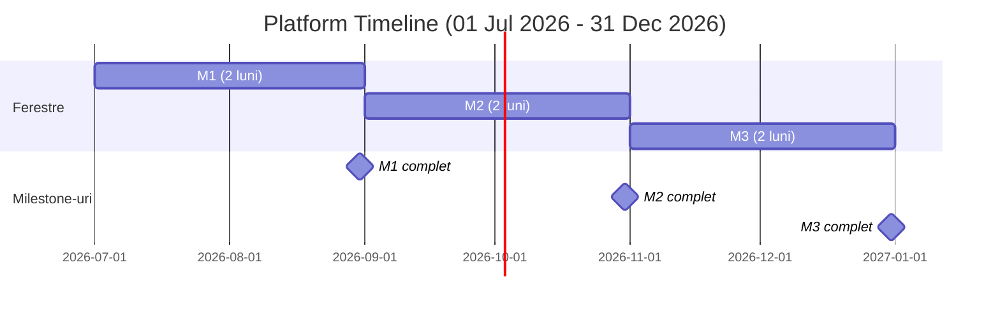

# Estimări Platformă (Recalibrare Post-MVP – Scope extins)

Scop: definim extensiile necesare transformării produsului MVP (single SSM-ist) într-o Platformă multi-tenant completă operată de un Platform Owner, având ca clienți principali SSM-iștii (fiecare SSM-ist = tenant izolat logic). Conform noii decizii, toate elementele marcate anterior ca „out-of-scope” (Plăți, QES, Site Public, SMS, S3 add-on) intră în scope de bază. Eliminăm din scope: Feature Flags/Planuri, Advanced Reporting/Data Mart, Bulk Operations, Inspector Portal avansat. Simplificăm Observabilitatea la un pachet minim.

---

## Asumări Platformă
- Multi-tenancy logic (un tenant per SSM-ist) cu separare clară a datelor și garduri de securitate (row-level & service-level checks).
- Rol Platform Owner (operațional) cu vizibilitate la nivel de sănătate sistem (status job-uri, erori agregate) fără acces la conținut documente.
- Extindere engine documente: versiuni, template condițional avansat
- Notificări programabile cu SMS inclus (email + SMS reminders) – chain & ferestre orare simple.
- Plăți & Subscription (Stripe) + Semnatura Avansata + Site Public (landing + pricing + blog simplu) + S3 multi‑region & failover (extensie peste S3 din MVP) SUNT în scope de bază.
- Inspector Portal rămâne versiunea MVP (link read-only); NU dezvoltăm versiune avansată.

---

## Reutilizare din MVP (NU se mai estimează)
Acoperit deja (1,210h): Auth & RBAC minim, CRUD companii & organigramă (import Excel), invitații, pachete de bază (training+test+doc), training viewer, test runner (scoring), template & generare simplă (parametri+tabele), storage S3 + arhivare GDrive, self-sign, notificări de bază, rapoarte de bază, inspector link read-only, audit minimal, CI/CD simplu, teste E2E critice inițiale, securitate de bază.

---

## Structură Estimări Extensii
Reorganizăm segmentarea Frontend pentru claritate operațională și ownership:
- FE User (reused din MVP) – include fluxurile deja livrate pentru SSM-ist și ierarhia companiilor (nu se mai estimează aici; doar eventuale adaptări minore absorbite în sinergie).
- FE Core Shared – componente transversale noi sau adaptate (tenant switching, health KPIs, elemente comune template/versioning, notificări UI extinsă, integrare QES/Payments în shell comun, elemente site public generice).
- FE Business (nou) – capabilitățile comerciale și avansate adăugate în această fază: UI Payments, QES wizard, Versioning & Retention views, Template advanced controls, Site Public pagini marketing, Notifications & SMS scheduling.

Pachetele de estimare devin:
1. Core Backend Extins
2. FE Core Shared
3. FE Business (nou)
4. DevOps / QA / Securitate Extins
5. Opționale viitoare (Advanced Reporting, Bulk Ops, Template Engine etapa 2, Inspector avansat, Feature Flags)

Țintă recalibrată: introducerea tuturor capabilităților (Plăți, QES, Site Public, SMS, S3 add-on) ridică incrementalul; obiectiv: menținerea totalului sub ~2,400–2,550h dacă se acceptă amânarea a minimum unuia dintre modulele cu impact (QES / Site / replică S3) în cazul depășirii plafonului.

---

## 1. Pachet Core Extins (Backend)
Obiectiv: multi-tenancy robust, lifecycle document avansat, motor template extins, plăți, QES, notificări programabile cu SMS, versiuni & retention și hardening securitate.

| Componentă | Descriere | Estimare (h) |
|------------|-----------|---------------|
| Multi-Tenancy Layer | Model tenant, scoping queries, migrații, izolări test | 85 |
| Platform Owner Minimal (health only) | Endpoints sănătate agregată (erori, job lag) | 30 |
| Document Versioning & Retention | Versiuni, retention config, legal hold | 90 |
| Advanced Template Engine (etapa 1) | Condiționale, bucle nested, imagini, secțiuni dinamice | 150 |
| Notifications Scheduler + SMS | Chain reminders, ferestre orare, gateway SMS | 75 |
| Payments (Stripe) Backend | Customer, checkout, webhooks, plan logic simplu | 85 |
| QES Integration | Integrare furnizor, token, timestamp, audit semnătură | 180 |
| S3 multi‑region & failover (add‑on peste MVP) | Config replică + fallback + sync jobs | 55 |
| Site Public Backend Support | Endpoint content (blog/posts, pricing static) | 25 |
| Security Hardening extins | Rate limit per tenant, WAF/CDN integ., secret rotation | 40 |
| Observabilitate minimă | Log agregat structurat + metrici bază (latency, error rate) | 30 |
| SLA & Queue Hardening | Retry, dead-letter, metrici queue | 40 |

Subtotal Core: 885h

## 2. FE Core Shared
| Componentă | Descriere | Estimare (h) |
|------------|-----------|---------------|
| Tenant Switching & Context Banner | Componente context tenant reutilizabile | 20 |
| Platform Owner Health Widgets | Mini-card erori/job lag, stocare sumar | 20 |
| Shell Integrări (Payments/QES hooks) | Adaptări layout, stări globale abonament/QES | 15 |
| Template / Versioning Shared Components | Liste, diff view minimalist reutilizat | 25 |
| Notifications Shared Panel | Extindere panou existent pentru scheduling & SMS toggle | 20 |
| Common Marketing Elements | Header/Footer/SEO meta generator | 15 |

Subtotal FE Core Shared: 115h

## 3. FE Business (nou)
| Componentă | Descriere | Estimare (h) |
|------------|-----------|---------------|
| Payments (Stripe) UI | Checkout, abonament, status plan | 50 |
| QES Signing Wizard | Identitate + progres semnare calificată | 40 |
| Document Versioning & Retention Views | Istoric, restore, filtru retenție | 40 |
| Advanced Template Controls UI | Condiționale, secțiuni dinamice, imagini | 35 |
| Notifications & SMS Scheduling UI | Creare/reminder chain, ferestre orare | 30 |
| Site Public Pagini | Landing, pricing, blog list, articol, SEO bază | 70 |

Subtotal FE Business: 265h

FE Total (Core Shared + Business): 380h

## 3. DevOps / QA / Securitate Extins
| Componentă | Descriere | Estimare (h) |
|------------|-----------|---------------|
| Pipeline multi-tenant & seed orchestration | Seed per tenant, test matrix | 30 |
| Teste E2E extinse | Multi-tenant, versioning, payments, QES, SMS | 90 |
| Backup & DR formal | Snapshots, restore drills, rotație chei, runbooks | 45 |
| Performance & Load | Profiling, caching, concurrency test | 40 |
| Compliance & Security review QES/Payments | Politici chei, rotație, checklist audit | 25 |

Subtotal DevOps/QA: 230h

---

## 4. Total Increment Estimat (Bază)
- Core Backend: 885h
- FE Core Shared: 115h
- FE Business: 265h
- DevOps/QA: 230h

Total (bază): 1,495h

---

## 5. Milestone-uri și Timeline Platformă
Ipoteză: start fază Platformă 01 Jul 2026 după stabilizarea MVP (Q2 2026). Durată: ~6 luni.

### Milestone 1 — Luna 2 (Jul–Aug 2026): Multi-tenancy & Fundament Comercial
- Multi-tenancy layer + tenant switching UI
- Payments Stripe (backend + UI) flux abonament funcțional (fără rapoarte avansate)
- Notifications scheduler (email) + SMS gateway integrat (trimitere simplă)
- Observabilitate minimă + security hardening inițial
- Site Public variantă landing/pricing skeleton
Rezultat: onboarding primii SSM-iști plătitori (fără QES încă).

### Milestone 2 — Luna 4 (Sep–Oct 2026): Document Lifecycle & Semnătură Calificată
- Document Versioning & Retention
- Advanced Template Engine etapa 1
- QES integrare completă + UI
- Site Public complet (blog, SEO meta) + S3 replică/failover
- Notifications chain + SMS ferestre orare
Rezultat: ofertă diferențiatoare conformitate & semnare avansată.

### Milestone 3 — Luna 6 (Nov–Dec 2026): Stabilizare & Reziliență
- SLA & Queue hardening, Performance tests
- DR & Backup drill, secret rotation
- Optimizări UX template/versioning
- Hardening final securitate & metrici p95 stabile
Rezultat: platformă pregătită pentru scalare controlată (10+ SSM-iști) cu QES și plăți stabile.

---

## 6. Diagrama Gantt (Mermaid) — Platformă (01 Jul 2026 – 31 Dec 2026)

